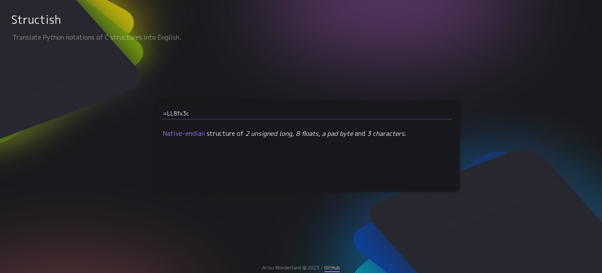
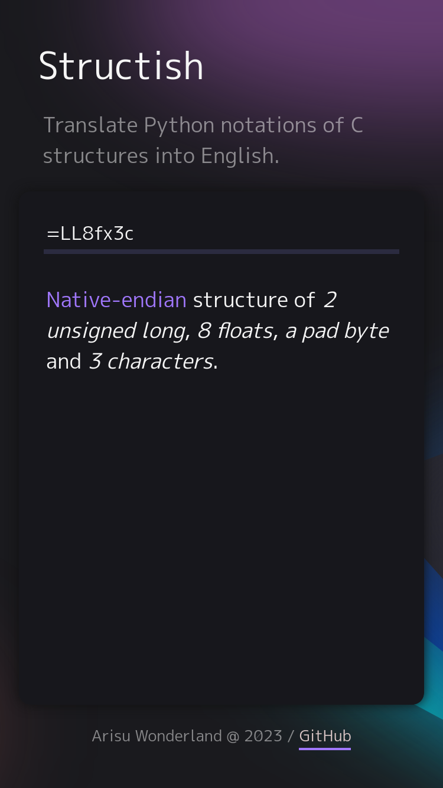

    <h1 align="center">Structish</h1>
    

        <!-- 
          -->
        Translate Python notations of C structures into English.
    

| Desktop | Mobile |
|---------|--------|
|  |  |

## Getting started

The public instance is available at [https://arichr.github.io/structish/](https://arichr.github.io/structish/).

For more information about supported symbols, see [the Python Wiki](https://docs.python.org/3/library/struct.html#byte-order-size-and-alignment).
